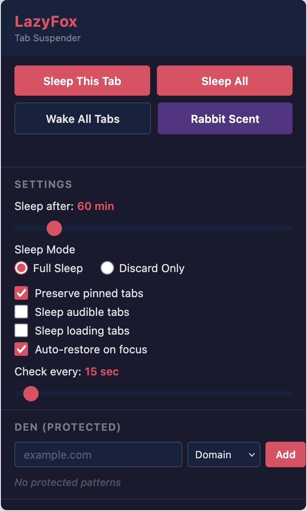

# LazyFox

LazyFox is a lean, open-source browser extension that automatically puts inactive tabs to sleep, saving CPU, GPU, and memory. Think of it as a lazy fox — it only chases (keeps awake) the tab you're actively using, and lets the rest nap.

<div style="display: flex; justify-content: center; align-items: center;">
    
</div>

## How It Works

**Tab Sleeping**: When a tab sits inactive longer than your configured timeout (default 60 minutes), LazyFox replaces the page with a lightweight "sleeping page" that shows the tab's title, URL, and a wake button. The original page state is saved so it can be restored instantly. The sleeping page itself uses near-zero resources.

**Tab Discarding**: An alternative, even lighter mode that uses the browser's built-in tab discarding (`tabs.discard()`). No sleeping page — the browser unloads the tab entirely and shows its default discarded state.

**Eligibility Check**: Every 15 seconds (configurable), the background service worker runs through all open tabs and checks each one against a set of rules. A tab is only put to sleep if it passes ALL checks:

1. Has a real URL (not a restricted protocol like `chrome://` or `about:`)
2. Is not already sleeping or discarded
3. Is not the currently active tab
4. Is not pinned (configurable — preserve pinned tabs is on by default)
5. Is not playing audio (configurable)
6. Is not still loading (configurable)
7. Has been inactive longer than the sleep timeout
8. Is not in your Den (protected patterns)
9. Does not have an active Rabbit Scent

At most 5 tabs are slept per check cycle to avoid browser throttling.

**Waking**: Click the "Wake Up" button, click anywhere on the sleeping page, or switch to the tab (if auto-restore is on). The original URL and tab state (pinned, muted) are restored instantly.

## Key Concepts

### Rabbit Scent

A temporary keep-awake for **one specific tab**. Give the current tab a "rabbit scent" and that tab alone stays awake for the configured duration (default 60 minutes), regardless of the sleep timeout. Other tabs continue to sleep normally.

Key behaviors:

- **Per-tab, not per-domain** — the scent tracks the tab by its browser tab ID. If you navigate to a different URL in the same tab, the scent stays active. If you close the tab, the scent is gone.
- **Timer persists across popup closes** — stored in browser session storage. Reopening the popup on the scented tab restores the countdown. Opening the popup on a different tab shows no timer (it has no scent).
- **Only one active scent** — giving a new scent to a tab replaces any previous one. You can have one active scent at a time.
- **Remove early** — click "Remove Rabbit Scent" to cancel the scent before it expires.
- **Use Den for domain-wide protection** — if you want ALL tabs on `github.com` to stay awake, add it to the Den instead.

(The name comes from the macOS tool "Amphetamine" which keeps computers awake, adapted to fit the fox theme — the fox avoids rabbit-scented tabs.)

### Den

Your list of protected URL patterns. Tabs matching a den entry are never put to sleep, even if they're inactive. Supports three match types:

- **Exact**: matches the full URL exactly (`https://docs.google.com/document/abc123`)
- **Domain**: matches the domain and all subdomains (`google.com` protects `mail.google.com`, `docs.google.com`, etc.)
- **Wildcard**: glob-style pattern (`https://github.com/*/pull/*`)

### Sleep Modes

- **Full Sleep** (default): Replaces the tab with a dark-themed sleeping page showing the original tab's info and a wake button. Most resource-efficient.
- **Discard Only**: Uses the browser's native `tabs.discard()` API. No custom page — the tab shows the browser's default discarded appearance, and wakes when you switch to it.

## Features

- **Automatic tab sleeping** — sleeps inactive tabs after a configurable timeout (default 60 min)
- **Two sleep modes** — Full Sleep (custom sleeping page) and Discard (native browser discard)
- **Rabbit Scent** — temporarily keep specific tabs awake, with configurable duration
- **Den** — protect important domains/pages from ever being put to sleep
- **Dark-themed UI** — popup and sleeping page styled with a clean dark palette
- **Privacy-first** — no tracking, no ads, no remote code. Everything runs locally
- **Cross-browser** — Chrome and Firefox from a single codebase (Manifest V3)
- **Open source** — MIT license

## Installation

### Firefox Add-ons

Install from [Firefox Add-ons](#) (link coming soon).

### Chrome (Manual Sideload)

Chrome users can install from the ZIP attached to the [latest GitHub Release](https://github.com/tabber/lazyfox/releases):

1. Download `lazyfox-*-chrome.zip` from the latest release
2. Unzip it
3. Go to `chrome://extensions`, enable "Developer mode"
4. Click "Load unpacked" and select the unzipped folder

### Development Build

```bash
git clone https://github.com/tabber/lazyfox.git
cd lazyfox

pnpm install

pnpm dev          # Dev mode (Chrome)
pnpm dev:firefox  # Dev mode (Firefox)

pnpm build          # Production build (Chrome)
pnpm build:firefox  # Production build (Firefox)
```

## Development

### Tech Stack

- [WXT](https://wxt.dev) — framework for cross-browser extension development
- [TypeScript](https://www.typescriptlang.org/) — strict mode
- Manifest V3
- [Vitest](https://vitest.dev) for testing
- ESLint + Prettier for code quality

### Project Structure

```
src/
  entrypoints/
    background.ts      # Service worker (alarms, message routing, tab sleep/wake)
    popup/             # Popup UI (controls, settings, den editor)
    sleeping/          # Sleeping page (shown when a tab is put to sleep)
  types/
    index.ts           # Shared type definitions and message contracts
  utils/
    alarms.ts          # Alarm scheduling helpers
    logger.ts          # Namespaced logger
    storage.ts         # WXT storage wrappers
    tabEligibility.ts  # Tab sleep eligibility checks (29 unit tests)
  config.ts            # Configuration defaults and types
public/
  icons/               # Extension icons (16-128px)
```

### Scripts

| Script               | Description                                        |
| -------------------- | -------------------------------------------------- |
| `pnpm dev`           | Start dev mode for Chrome                          |
| `pnpm dev:firefox`   | Start dev mode for Firefox                         |
| `pnpm build`         | Production build for Chrome                        |
| `pnpm build:firefox` | Production build for Firefox                       |
| `pnpm zip`           | Create Chrome distribution ZIP                     |
| `pnpm zip:firefox`   | Create Firefox distribution ZIP (includes sources) |
| `pnpm typecheck`     | TypeScript type checking                           |
| `pnpm lint`          | ESLint                                             |
| `pnpm format`        | Prettier                                           |
| `pnpm test`          | Vitest test suite                                  |

## License

MIT
